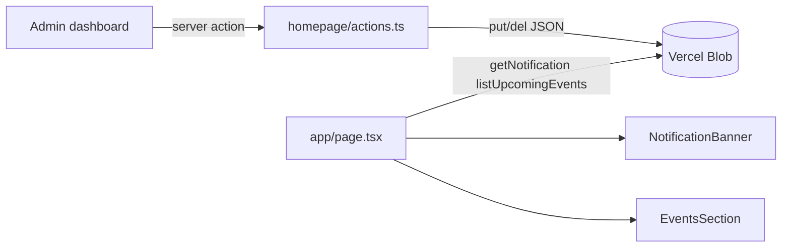

## Data model (Vercel Blob)

Mirror the existing `lost-and-found` pattern: zod schemas + a small `items.ts`-style module per feature, persisted as JSON blobs.

- `notification.json` — single blob, shape:
  - `{ message: string; visible: boolean; updatedAt: string }`
- `events/{slug}.json` — one blob per event, shape:
  - `{ id: string; slug: string; title: string; description: string; date: string /* YYYY-MM-DD */; linkUrl: string | null; linkLabel: string | null; createdAt: string; updatedAt: string }`

Homepage filters events to `date >= today` (local time, America/New_York to match the course) and sorts ascending by date. Admin page shows all events.

## Shared storage helper

The current `lib/lost-and-found/storage.ts` is generic. Lift it to `lib/blob.ts` (keeping `putJson` / `getJson` / `listPathnames` unchanged) and update the two internal imports in [lib/lost-and-found/settings.ts](lib/lost-and-found/settings.ts) and [lib/lost-and-found/items.ts](lib/lost-and-found/items.ts). This avoids duplicating blob plumbing for the new feature.

## New files

- [lib/homepage/types.ts](lib/homepage/types.ts) — zod schemas: `notificationSchema`, `eventSchema`, plus input schemas `notificationInputSchema`, `eventInputSchema` (trimmed title/description, ISO date, optional URL validated with `z.url()`).
- [lib/homepage/notification.ts](lib/homepage/notification.ts) — `getNotification()`, `updateNotification(input)`. Returns a default `{ message: "", visible: false }` when blob is missing so the banner just hides.
- [lib/homepage/events.ts](lib/homepage/events.ts) — `listEvents()`, `listUpcomingEvents()`, `getEventBySlug()`, `createEvent(input)`, `updateEvent(slug, input)`, `deleteEvent(slug)`. Uses `newSlug()` from [lib/lost-and-found/slug.ts](lib/lost-and-found/slug.ts) (or a new small slug helper if you prefer isolating it — the existing nanoid generator is reusable).
- `EVENTS_PREFIX = "events/"` and `NOTIFICATION_PATH = "notification.json"` constants.

For deletion, add a `delJson(pathname)` wrapper around `@vercel/blob`'s `del` in `lib/blob.ts` (lost-and-found doesn't delete today, so this is additive).

## Admin actions

New [app/admin/homepage/actions.ts](app/admin/homepage/actions.ts) with `"use server"` and the same `requireAdmin()` + `ActionResult` pattern as [app/admin/lost-and-found/actions.ts](app/admin/lost-and-found/actions.ts):

- `updateNotificationAction(formData)` — validates, saves, `revalidatePath("/")` and `revalidatePath("/admin")`.
- `createEventAction(formData)` / `updateEventAction(slug, formData)` / `deleteEventAction(slug)` — revalidate `/` and `/admin/events`.

## Admin UI

- [app/admin/page.tsx](app/admin/page.tsx) (Dashboard): replace placeholder with a single `NotificationForm` card (message textarea + "Show on homepage" switch + Save). Server-fetches current notification.
- New `app/admin/events/page.tsx` + `app/admin/events/_components/events-manager.tsx`: a card with a "New event" button that opens an inline form (title, description, date picker, link URL, link label), and a list below grouped as "Upcoming" and "Past", each row with Edit / Delete. Mirrors the client-side pattern in [app/admin/lost-and-found/_components](app/admin/lost-and-found/_components).
- Add an "Events" entry to `navigation` in [components/admin/app-sidebar.tsx](components/admin/app-sidebar.tsx) using a calendar icon from `lucide-react`.

## Homepage rendering

Edit [app/page.tsx](app/page.tsx) (already `async`):

- Fetch `getNotification()` and `listUpcomingEvents()` in parallel at the top.
- Replace the commented-out banner (lines 25-28) with a real `NotificationBanner` that renders only when `notification.visible && notification.message.trim()`.
- Add an `EventsSection` between the hero/action cards section and "The Legacy of the Pines" section. Stylized card list: title, date (formatted like "Sep 28"), description, optional CTA link. If `listUpcomingEvents()` is empty, don't render the section at all.

Both subcomponents live in a new `app/_components/` folder (server components, no `"use client"` needed).

## Flow

## Things worth flagging (answers to "anything I'm missing?")

- Timezone: "past vs upcoming" needs a fixed zone or users in different TZs will see flicker around midnight. Plan uses America/New_York via `Intl.DateTimeFormat` for both filtering and display.
- Link validation: use `z.url()` and require `https://` to avoid broken links; show the hostname next to the link label.
- Empty states: hide the banner and events section entirely when nothing is active, so the homepage stays clean.
- No auth on reads (notification + events are public), but all mutations go through `requireAdmin()` exactly like lost-and-found.
- Revalidation: mutations `revalidatePath("/")` so the homepage updates immediately.
- Out of scope intentionally: scheduled notifications, per-event visibility toggle, images/attachments on events. Easy to add later with the same shape.