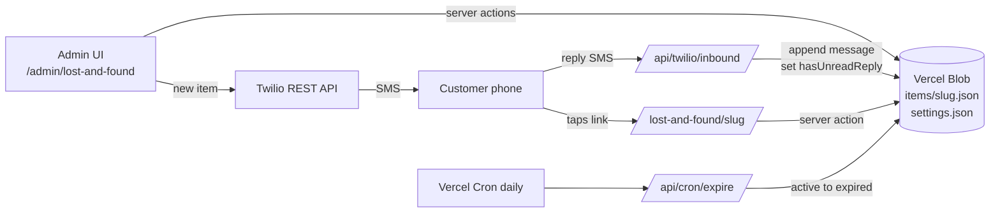

## Architecture



## Storage layout (Vercel Blob, one JSON file per item)

Per-item blob at `items/<slug>.json` avoids the whole-file clobber problem. Settings live in `settings.json`. Listing ~20 items via `list({ prefix: "items/" })` is trivial.

- Item shape: `id`, `slug` (nanoid 8-char), `name`, `phoneE164 | null`, `description`, `notes`, `status` (`active | saving | expired | donated | returned`), `hasUnreadReply`, `submittedAt`, `expiresAt`, `updatedAt`, `messages[]` (`direction`, `body`, `twilioSid`, `at`).
- Settings shape: `defaultMessage` (supports `{name}` and `{link}` tokens), `daysUntilExpiration`.
- Concurrency note: two admin writes to the same item within the same second could race. Acceptable at ~20 items/month; we'll document it.

## Dependencies to add

- Runtime: `@vercel/blob`, `twilio`, `zod`, `nanoid`.
- shadcn components: `table`, `form`, `select`, `textarea`, `badge`, `sheet` (already present), `dialog`, `dropdown-menu`, `label`, `card`, `sonner`, `tabs`.

## Files to create

### Domain / infra ([lib/lost-and-found/](lib/lost-and-found/))

- `types.ts` — Status union, zod schemas for `Item`, `Settings`, `NewItemInput`, `PublicUpdateInput`.
- `storage.ts` — thin wrappers over `@vercel/blob` `put`/`list`/`head`/`del` with JSON helpers.
- `items.ts` — `listItems`, `getItemBySlug`, `createItem`, `updateItem`, `appendMessage`.
- `settings.ts` — `getSettings` (with defaults), `updateSettings`.
- `phone.ts` — E.164 normalization + continental-US check (reject area codes 907 AK, 808 HI, and non-+1).
- `slug.ts` — `nanoid(8)` with retry-on-collision.
- `twilio.ts` — `sendSms`, `validateInboundSignature`, message templating (`{name}`, `{link}`).
- `expiration.ts` — `expireOverdueItems()` used by the cron route.

### Public routes

- `app/lost-and-found/[slug]/page.tsx` — server component loads item, renders a mobile-first card. If `expired`, show terminal message. Otherwise render a small form (status: `Saving | Donated | Returned`, notes textarea) using a server action in the same file. No auth — the slug is the capability. Rate limit is not worth it at this volume; collision-resistant 8-char slug is sufficient.
- `app/api/twilio/inbound/route.ts` — POST endpoint. Parses `application/x-www-form-urlencoded`, validates `X-Twilio-Signature` using `twilio.validateRequest`, finds the item whose `phoneE164` matches `From` (most recent non-terminal if multiple), appends the message, sets `hasUnreadReply=true`. Never mutates status. Returns empty `<Response/>` TwiML.
- `app/api/cron/expire/route.ts` — GET protected by `Authorization: Bearer ${CRON_SECRET}`. Calls `expireOverdueItems`.

### Admin UI ([app/admin/lost-and-found/](app/admin/lost-and-found/))

- `page.tsx` — server component, loads items + settings, renders `<ItemsTable>`.
- `_components/items-table.tsx` — client component. Status filter as a `Tabs` row (`All, Active, Saving, Expired, Donated, Returned`) plus a "New entry" button that opens `new-item-sheet.tsx`. On mobile (`< md`) renders a stacked card list; on `md+` renders the shadcn `Table`. Row shows name, phone, status badge, description, submitted-at relative, and a dot/badge when `hasUnreadReply`.
- `_components/new-item-sheet.tsx` — shadcn `Sheet` with shadcn `Form` + zod. Fields: name, phone (optional), description, notes. Submits via server action in `actions.ts`.
- `_components/item-detail-sheet.tsx` — opens on row click. Shows full details, the message thread, and a `Select` to change status (any value). Saving clears `hasUnreadReply`.
- `actions.ts` — `createItemAction`, `updateItemStatusAction`, `markReplyReadAction`, `updateSettingsAction`. All use `auth()` + `isAdminEmail` re-check (belt and suspenders, matching existing pattern in [app/admin/layout.tsx](app/admin/layout.tsx)).

### Admin settings page

- `app/admin/settings/page.tsx` + `_components/settings-form.tsx` — two fields: `defaultMessage` (textarea with help text listing `{name}` and `{link}` tokens) and `daysUntilExpiration` (number). Add a "Settings" nav item to [components/admin/app-sidebar.tsx](components/admin/app-sidebar.tsx) and extend `getCurrentPageLabel` in [app/admin/_components/admin-layout-client.tsx](app/admin/_components/admin-layout-client.tsx).

## Key behaviors

- **New entry submission** (`createItemAction`): normalize phone → if null or non-continental-US, set `status = "donated"` and skip SMS. Otherwise compute `expiresAt = submittedAt + daysUntilExpiration`, generate slug, persist item, then send SMS using templated `defaultMessage` with `{link}` replaced by the public URL. Record the outbound message.
- **Inbound reply**: append to `messages`, set `hasUnreadReply=true`. Status unchanged (per your call).
- **Expiration cron**: daily at 06:00 UTC (`vercel.json` cron), `active && expiresAt <= now` → `expired`. Only `active` flips; all other statuses are terminal/manual.
- **Public self-serve**: customer may set `saving | donated | returned` and edit `notes` (appended, not replaced, so admin sees the chain). If item is `expired`, form is hidden and a "This link is no longer active" message shows.
- **Filter by status**: client-side filtering in `items-table.tsx` since n is tiny.

## Environment variables

- `TWILIO_ACCOUNT_SID`, `TWILIO_AUTH_TOKEN`, `TWILIO_FROM_NUMBER` — Twilio API + signature validation.
- `NEXT_PUBLIC_APP_URL` — used to build the `{link}` URL in SMS.
- `CRON_SECRET` — gates `/api/cron/expire`.
- `BLOB_READ_WRITE_TOKEN` — auto-populated once the Vercel Blob store is linked.

## Operational setup (one-time)

1. `vercel blob store add` (or via dashboard), then `vercel env pull`.
2. In Twilio console, set the phone number's "Messaging: A message comes in" webhook to `https://<domain>/api/twilio/inbound`.
3. Add cron to `vercel.json`:

```json
{ "crons": [{ "path": "/api/cron/expire", "schedule": "0 6 * * *" }] }
```

## Out of scope (flag for later)

- No pagination / search-by-name — unneeded at this volume.
- No audit log of status changes (messages array gives a decent trail already).
- No rate limiting on the public slug page — 8-char nanoid is sufficient capability security; add later if needed.
